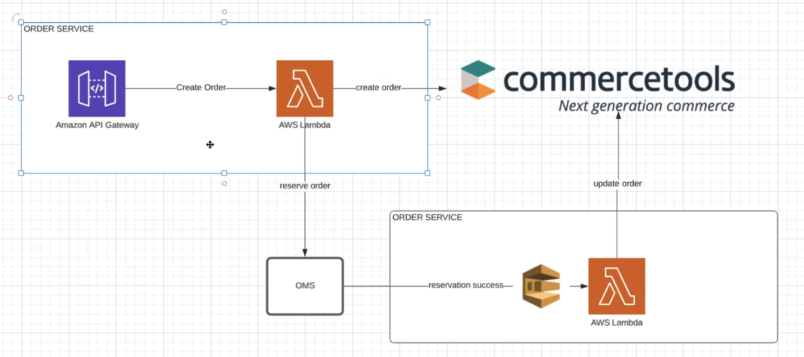

# order-service-commercetools (MACH example)

Open-source hands-on guide to build real production ready order-service using commercetools platform

## Architecture overview

## Build

`ENV=dev0x yarn build`

## Deploy

If build is packaged:
`ENV=dev0x yarn deploy-package`

Deploy entirely:
`ENV=dev0x yarn deploy`

To specify custom profile:
`ENV=dev0x PROFILE=local yarn deploy`

To specify another region
`ENV=dev0x PROFILE=local REGION=us-west-2 yarn deploy`
